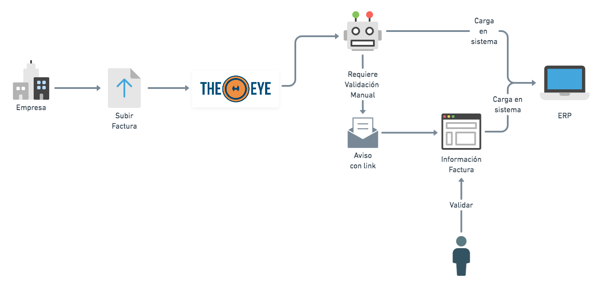
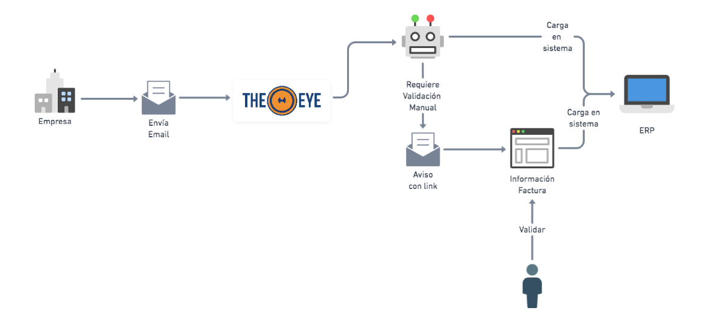
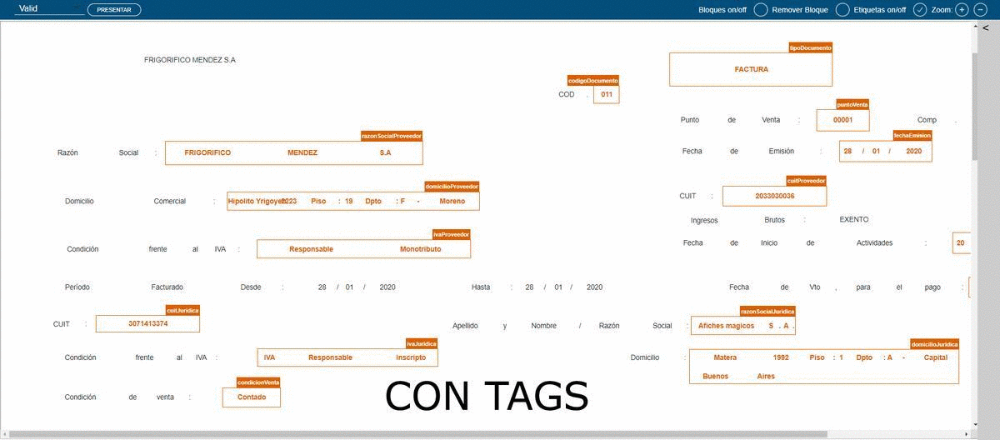
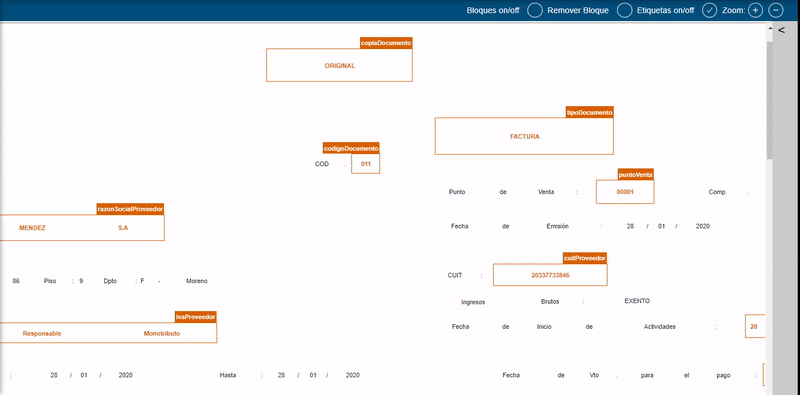
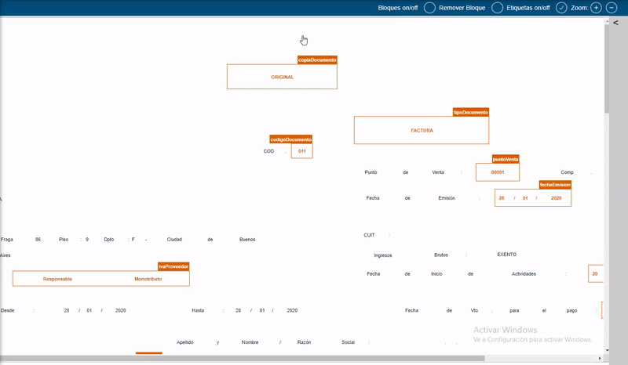
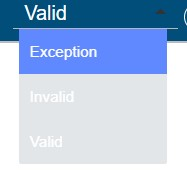
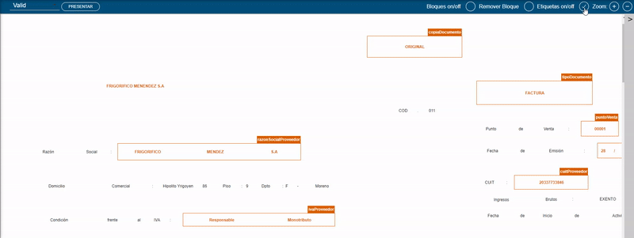
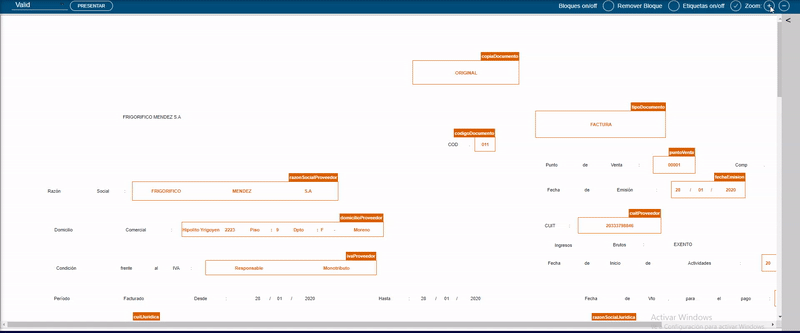

# Que es Tagger de TheEye?

Tagger de The Eye es una herramienta que permite de forma automática reconocer información contenida en comprobantes de compra de la República Argentina. Mediante técnicas de Inteligencia Artificial, el sistema es capaz de reconocer y extraer la información relevante de los documentos con mucha precisión. Tagger utiliza TheEye como orquestador, lo que le permite integrarse a cualquier ERP y cargar la información extraída automáticamente, con baja intervención manual reduciendo el tiempo de carga notablemente.

Actualmente el sistema fue entrenado para extraer la información de los siguientes tipos de comprobantes:

* Facturas

* Notas de Crédito

* Notas de Débito

La precisión del reconocimiento varía según la calidad del documento a reconocer. Los mejores resultados se obtienen con documentos Digitales, como por ejemplo las facturas de AFIP. Las principales características que influyen en la precisión del proceso son:

* Nitidez

* Alineación del texto en relación a los bordes

* Alineación de los datos

* Manchas, rayones

* Ubicación y formato del texto

* Digital o manuscrita

En caso de ser un escaneos, la nitidez, alineación, manchas, imágenes de fondo, etc. influyen en el reconocimiento y la probabilidad de fallar o no detectar la información es mayor.

Luego de leerse y procesarse los documentos, el sistema verifica si la información extraída es correcta. En caso de encontrarse información incorrecta, que se detecten inconsistencias o falta de información, el usuario deberá validar el documento usando la interfaz de revisión.

******

# Workflows de Carga

Actualmente existen dos workflows de carga de facturas. Desde un input en donde se pueden dejar las facturas, permite multiples facturas, o con un mailbot. El mailbot requiere acceso a una casilla de correo

## Subida de archivos.

## MailBot.

******

# Validación y corrección de datos de un comprobante

Cuando los comprobantes pasan por el proceso de reconocimiento pueden requerir revisión manual para validar los datos encontrados. Esta validación se realiza desde una interfaz Web como la que se muestra en la siguiente imagen:

Cada uno de los datos detectados del comprobante está representado por un **tag**  o etiqueta (e.g. cuitProveedor, razonSocialProveedor). El dato marcado con cada tag puede ser corregido o incluso re-asignado a otro tag usando la interfaz. A continuación se muestra cómo asignar y/o corregir un tag.

Para seleccionar texto y asignarle un tag, se debe hacer click y arrastrar formando un cuadro sobre todo el texto deseado y luego soltar. 

******

# Herramientas de la Interfaz

La lista completa de TAGS se encuentra oculto en el panel lateral derecho.
Usando la pestaña con el icono de tres líneas (hamburger):

se despliega la lista completa de los tags para los datos que comúnmente pueden aparecer en los documentos. Tómese algún tiempo para familiarizarse con las etiquetas más comunes. Si no encuentra la etiqueta para algún dato, contactenos.

Al lado del título “TAGS” se encuentra el botón (-) que oculta todos los tags vacíos, al presionarlo nuevamente vuelven a aparecer.

**Edición de datos seleccionados**

Los datos asignados a los tags pueden ser editados utilizando el botón del lápiz que se encuentra a la derecha de cada valor.

**Inserción de datos no seleccionables**

Al lado del título de cada uno de los tags se encuentra el botón (+) que permite ingresar un dato cuando no se encuentra presente en el documento, ya sea por fallos en el OCR, en los casos de documentos multipágina o porque requieren ingreso manual.

**Presentación y envío de datos**

Una vez finalizada la selección y edición, se debe presionar el botón **Presentar** para continuar con el proceso de carga. El sistema almacena las etiquetas y envía los tags para que sean procesados y almacenados en el sistema de gestión.

Al presionar el botón se realizan verificaciones sobre los datos para asegurar que no haya errores en los datos a enviar. Si algún data necesario fuese incorrecto o faltase, se mostrará un cartel y no se podrá continuar con el envío de los datos hasta corregir el la falla. (adjuntar link lista de errores y documentar cada uno)

En el cuadro de selección que se encuentra al lado del botón **Presentar** se debe elegir si el documento es Válido o Inválido. En la mayoría de los casos la selección por defecto “Valid” es la correcta. En caso en que no se pueda o no se deba proceder a cargar el documento en el sistema, puede optar por Invalidar el documento para cancelar la operación. Debe elegir “Invalid” y presionar el botón **Presentar**. De esta forma el documento se marca como Invalid y luego deberá ser procesado de forma manual.

**Nota: Ningún documento puede ser borrados. Todo el historial de documentos procesados Válidos e Inválidos quedan almacenados en la cuenta del usuario.**

******

# Herramientas adicionales.

## Bloques

La forma en que se representa el texto extraído del documento, es mediante bloques. Los bloques pueden estar compuestos por palabra, números, símbolos o letras individuales. La vista de bloques puede ser activada utilizando el botón

Ocasionalmente aparecen bloques superpuestos. Cuando estos casos dificultan la selección del dato se puede remover bloques utilizando el botón para tal fin.

A continuación se muestra cómo remover bloques de texto

.gif)

******

# Zoom

Los botones de Zoom facilitan la lectura el texto cuando se superpone o si es muy pequeño. Esto permite obtener mayor nivel de detalle, manteniendo la ubicación original del texto al seleccionar los datos

## **Ejemplo**

******

# FAQ

Ante dudas consultas, visite nuestra sección de pregunta y respuestas frecuentes.

[Ir a la FAQ](./faqs.md)

## Tiene dudas o consultas sin respuesta? [Contactanos](https://theeye.io/facturas.html#contact)

******
